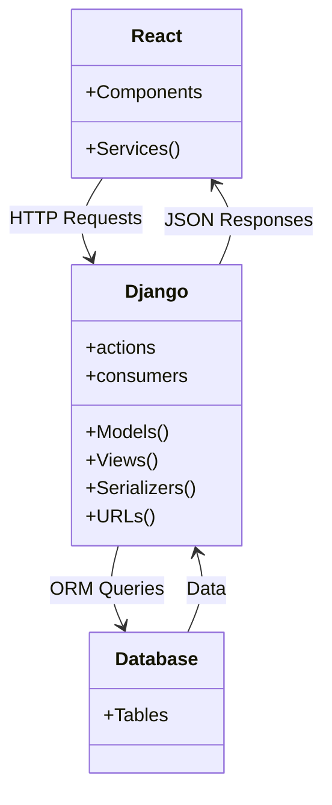

# DIGI

DIGI es un sistema diseñado para optimizar y agilizar la gestión de tickets entre clientes, digitadores y cajeros en una papelería. Proporciona un control eficiente y una visualización clara de los procesos, permitiendo a los usuarios generar reportes de pagos y monitorear en tiempo real las métricas de todos los tickets. Esto garantiza un seguimiento detallado y actualizado de todas las transacciones.

Este proyecto se divide en dos directorios principales:

- **frontend**: Contiene el código del frontend (React).
- **backend**: Contiene el código del backend (Django).

## Requisitos previos

Antes de comenzar, asegúrate de tener instalados los siguientes componentes:

- **Node.js** (versión 14.x o superior)
- **npm** o **yarn** (para la gestión de dependencias del frontend)
- **Python** (versión 3.8 o superior)
- **pip** (para la gestión de dependencias del backend)
- **virtualenv** (opcional, pero recomendado para crear entornos virtuales de Python)


## Estructura del Proyecto

```bash
/
├── frontend/        # Carpeta del frontend (React)
│   ├── src/         # Código fuente de React
│   ├── public/      # Archivos públicos de React
│   └── package.json # Archivo de configuración de Node.js
│
└── backend/         # Carpeta del backend (Django)
    ├── app/         # Aplicación principal de Django
    ├── manage.py    # Script de gestión de Django
    └── requirements.txt  # Dependencias de Python

```
## Instalación

### 1. Configuración del Backend (Django)

1.  Navega a la carpeta `backend`:
```bash
    cd backend
```

2.  Crea y activa un entorno virtual (opcional pero recomendado):
```bash
    python -m venv venv
    source venv/bin/activate  # En Windows: venv\Scripts\activate
```
    
3.  Instala las dependencias de Python:
```bash
    pip install -r requirements.txt 
```
4.  Realiza las migraciones de la base de datos:
    
```bash
    python manage.py migrate
``` 
    
5.  Ejecuta el servidor de desarrollo:
    
```bash
    python manage.py runserver
``` 

### 2. Configuración del Frontend (React)

1.  Navega a la carpeta `frontend`:
    
```bash
    cd frontend 
``` 
2.  Instala las dependencias de Node.js:
    
```bash
    npm install
    # o si usas yarn:
    yarn install
``` 
3.  Ejecuta la aplicación de React:
    
```bash
    npm start
    # o si usas yarn:
    yarn start
``` 

## Uso

1.  **Backend**: El backend estará disponible en `http://localhost:8000/` por defecto.
2.  **Frontend**: El frontend estará disponible en `http://localhost:3000/` por defecto.

## Diagram


